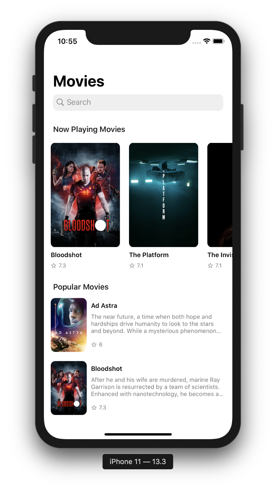
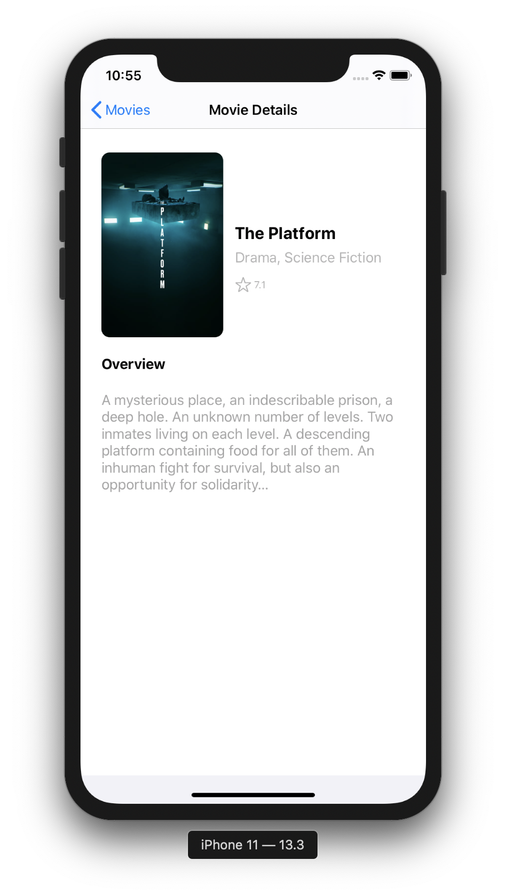
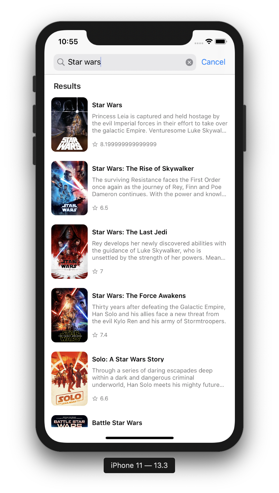

# ObjectiveCMovieDB

 

* **Platform:** iOS (Objective-C)
* **Aplication Language:** English

## Description
A simple Objective C app that consumes data from The Movie DB API made in order to study and learn the language. The app makes use of tableViews and CollectionViews, asynchronous API calls among other things.

Link to the API documentation: (https://developers.themoviedb.org/3/getting-started/introduction)

## Screenshots

